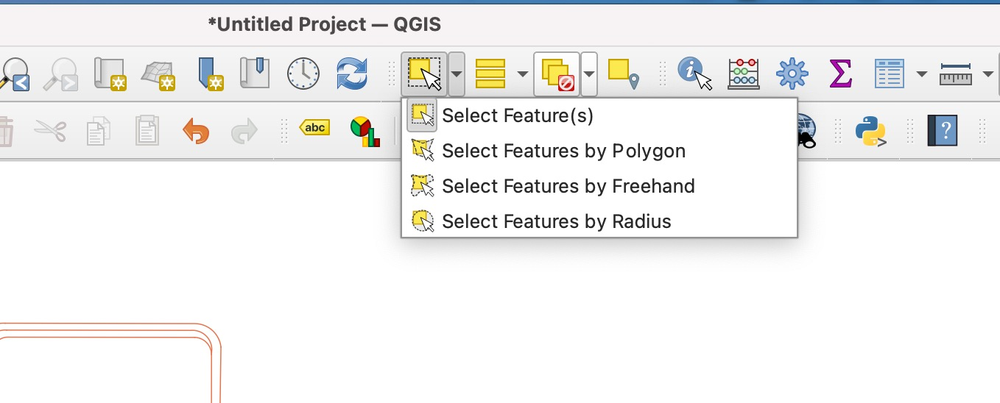
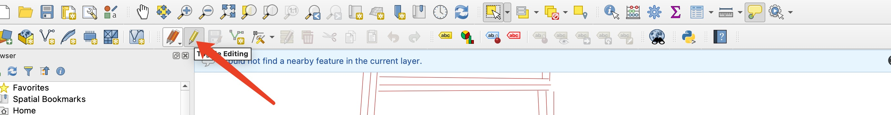
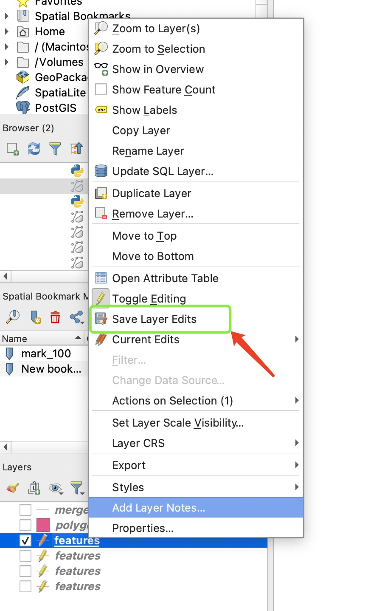

# split Features

+ 点击铅笔(toggle edting)-> 左上角工具栏 edit-> edit geometry -> split Features -> 屏幕选择合适的位置 左键单击 -> 拖动鼠标 -> 左键单击  -> 单击右键 -> 结束， 地图上会有一条分割的线生成 选中图层，点击右键 选中 save edit layer 将更改保存，即可在原有文件中查看到最新的修改记录数据。（点击右键时， 需要使用鼠标，触摸屏有些功能不能触发）

# 天地图-https://www.tianditu.gov.cn/
# 北京市公共数据开放平台-https://data.beijing.gov.cn/

## 删除geojson中的某个属性

选择select Feature 后，鼠标悬浮到图例并点击左键，即可选中，点击delete键删除

## 修改属性

- 选中某个属性后，点击铅笔，开始编辑

- 点击编辑-》 Edit Geometry -》 选择需要操作的名称-》点击-》 在选中的属性上单击， 即可开始操作修改属性， 完成后单击左键，完成编辑

- 点击页面左下角修改的图层， 点击右键，点击 save layer edits， 保存所做修改，修改将会同步保存到原有文件中
