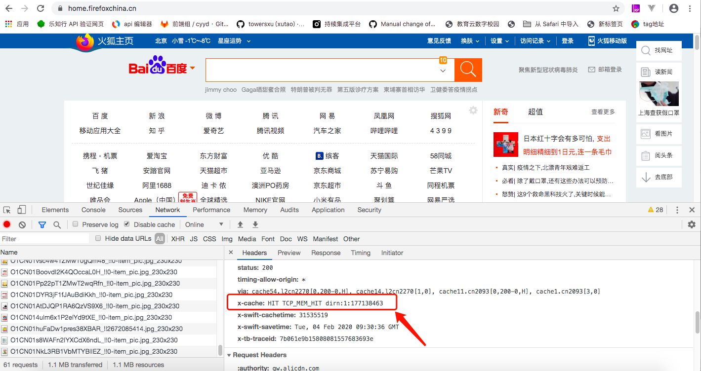

# h5页面性能优化

## 参考网站

[https://www.cnblogs.com/guangyun/p/8401285.html](https://www.cnblogs.com/guangyun/p/8401285.html)
[https://www.cnblogs.com/famensaodiseng/p/11820127.html](https://www.cnblogs.com/famensaodiseng/p/11820127.html)
[https://github.com/liudd596/H5-optimize](https://github.com/liudd596/H5-optimize)

## 资源加载

+ 首屏加载

      即在可见的屏幕范围内，内容展现完全，loading进度条消失

+ 按需加载

      首先要明确，按需加载虽然能提升首屏加载的速度，但是可能带来更多的界面重绘，
      影响渲染性能，因此要评估具体的业务场景再做决定。 比如页面中使用到的图片，
      如果对应的视图部分没有显示出来，先不加载，等对应视图显示出来后再加载。

  *Eg： 下面展示一个按需加载图片的逻辑*

  ```javascript
      // 页面加载完成时先调用一下，首屏内的图片。
      loadImg()
      document.addEventListener('scroll', function (e) {
      // 跟着滚动，继续加载剩下的图片
        loadImg()
      })
      function loadImg () {
      // slice可以将类数组转化成数组对象
        [].slice.call(document.querySelectorAll('[data-src]')).forEach(function (item) {
          // 判断元素是否已经进入视野
          if (item.getBoundingClientRect().y <= innerHeight) {
            // 设置src
            item.src = item.getAttribute('data-src')
            // 删除data-src属性，可以减少querySelectorAll的查询次数
            item.removeAttribute('data-src')
          }
        })
      }
      </img>
  ```

+ Lazyload

      Lazyload，即延迟加载，这并不是一个新的技术，在PC时代也是非常常用的
      一种性能优化手段。这个方案的原则是让屏幕外，或者不影响整体效果显示的
      图片、背景等资源，在界面就绪之后再进行网络加载。

+ 滚屏加载

      滚屏加载是一种常见的无刷新动态加载数据的方案，通常用在列表形式数据展示中。

+ ~~Media Query（响应式加载） ********~~

      通过这项技术，我们能够方便地控制资源的加载与显示。响应式网站在加载图片时，
      能自动识别智能终端图片，根据浏览设备做到自动加载响应图片。平均节省图片流
      量80%以上，下载速度更是可以提高5倍以上，网络响应高速，搜索引擎更喜欢。但
      是为了适配不同的设备，响应式设计需要大量专门为不同设备打造的css及js代码,
      这导致了文件增大，影响了页面加载速度。

+ 第三方资源异步加载

      防止第三方资源的使用影响到页面本身的功能。

+ Loading进度条

      给用户视觉感受， 能够知道加载的进度

+ 避免30*/40*/50*的http status

+ Favicon.ico

      如果我们没有设置图标ico，则会加载默认的图标：域名目录下的favicon.ico。
      很多开发者没有注意到这一点，就会导致这个请求404或者500。保证图片存在， 
      尽可能小一些， 并设置较长的缓存过期时间。

## 图片的使用

+ 图片的使用格式选择

      格式选择。显示效果较好的图片格式中，有webp、jpg和png24/32这几种常见的
      图片格式。一般来说，webp的图片最小，但在iOS或者android4.0以下的系统中
      可能会有兼容性问题需要解决；Jpg是我们最常使用的方案，大小适中，解码速度快，
      兼容性问题也基本不存在，是我们在H5的应用中使用起来性价比最高的方案；Png24
      或png32，一般来说，显示效果肯定会比jpg更好，但是实际上人眼很难感知出来，
      所以在H5应用中要避免这种格式的大图片。对于少量的图片，推荐用智图或者
      tinypng等工具来帮助自己选择合适的大小、格式。

+ 避免大小重设

      在html或者css中，如果有类似width: **px这样的代码，就要注意看一看了，如果
      说图片显示的效果是宽度100px，而下载的图片却是200px宽度，那这大小基本上就是
      所需要的4倍面积了，所以在H5应用中，使用图片的一个原则就是需要显示成多大，就
      下载多大的资源。

  智能PNG和JPEG压缩: [https://tinypng.com/](https://tinypng.com/)

  PNG压缩与格式转换工具: [https://isparta.github.io/](https://isparta.github.io/)

+ 像素控制

      在H5应用中，图片的像素要严格控制，一般来说不建议宽度超过640px

+ 避免DataURL

      h5下尽量避免使用dataUrl， 因为它的数据体积通常比二进制图片的格式大1/3，而
      且它不会被浏览器缓存，每次页面刷新都需要重新加载这部分数据。

+ 使用图片的替代(css3, svg, iconfont)

+ 小图片合并

      在html网页中，如果有多个小图片需要加载，不妨试试CSS Sprites方案，尤其是一
      些基本不变，大小差不多的操作类型图标。

## 域名/服务端部署

+ Gzip

      服务端要开启Gzip压缩。对用户请求的页面进行压缩处理，以达到节省网络带宽，提高网站速度的作用

      Nginx如何开启GZIP功能

      相对apache 和 IIS nginx开启GZIP简单很多，只需要打开配置文件 nginx.conf找到
      gzip on 把前面的注释符号#去掉即可开启GZIP服务。然后配置GZIP即可。

      下面是一个相对优化不错的配置，DNSLA建议使用。
      
      Gzip on;
      
      gzip_min_length 1024;
      
      gzip_buffers   4  8k;
      
      gzip_types   text/plain application/x-javascript text/css  application/xml;

+ 资源缓存，长cache

      合理设置资源的过期时间，尤其对一些静态的不需要改变的资源，将其缓存过期时间设置得长一些。

+ 分域名部署(静态资源域名)

      将动态资源和静态资源放置在不同的域名下，例如图片，放在自己特定的域名下。这样的好处是，
      静态资源请求时，不会带上动态域名中所设置的cookie头信息，从而减少http请求的大小。

+ 减少Cookie

      尽量减少Cookie头信息的大小，因为这部分数据使用的是上行流量，上行带宽更小，所以传输速
      度更慢，因此要尽量精简其大小

+ cdn加速

      部署CDN服务器，或者使用第三方的CDN加速服务，优化不同地域接入网站的带宽速度。CDN的关键
      技术主要有内容存储和分发技术。CDN的基本原理是广泛采用各种缓存服务器，将这些缓存服务器分
      布到用户访问相对集中的地区或网络中，在用户访问网站时，利用全局负载技术将用户的访问指向距
      离最近的工作正常的缓存服务器上，由缓存服务器直接响应用户请求。
      比如图片、视频、html等静态资源等都可以通过cdn缓存

    ···根据用户来源地址的不同，返回不同的结果， 具体图示如下
    

    *Tips:*
    > 判断网站是否使用了cdn:
    >>（参考网址： [https://blog.csdn.net/Fly_hps/article/details/98486807](https://blog.csdn.net/Fly_hps/article/details/98486807)）1、如果多地ping同一网站，出现多个
    解析IP地址，那么说明使用了CDN进行内容分发； 2、 使用nslookup查看域名解析对应的IP地址，
    如果解析到多个IP地址则说明使用了CDN， eg： nslookup www.baidu.com; 3、 使用CDN查询工
    具进行查看（该网址未成功打开）：[http://www.cdnplanet.com/tools/cdnfinder/](http://www.cdnplanet.com/tools/cdnfinder/)

    > 判断该url下是否命中cdn:
    >> 主要查看响应头信息中的“X-Cache”字段。显示“MISS”，说明没有命中CDN缓存，是回源的。
    显示“HIT”，是命中了CDN缓存。（via是http协议里面的一个header,通过代理和网关记录http
    请求x-cache是squid代理的自定义header,用来记录缓存的命中与否）

    

## 代码资源

+ Javascript, CSS合并

      尽量将所有的js和css合并，减少资源请求的次数。
      外联使用js, css：外联使用js和css，这样可以有效地利用缓存，避免html页面刷新后重新加载这部分代码。

+ 压缩html, js, css

      压缩代码，尤其是js和css资源，压缩后的大小可以降低至原来的1/3以下，有效节约流量。

+ 资源的版本更新

      库js、css通常不会更新，但是我们的业务js和css可能会有更新，如果命中浏览器缓存，可能会让
      一些新的特性不能及时展现，甚至可能导致逻辑上的冲突。

      因此对于这些js、css的资源引入，最好用版本号或者更新时间来作为后缀，这样的话，后缀不变，
      命中缓存；后缀改变，浏览器自动更新最新的代码。

+ Css位置

      CSS要放到html代码的开头的head标签结束前。如果网页是动态生成的，那么在head代码完成后
      可以强制输出（例如php的flush()操作），这样的话，浏览器就会更快地解析出来head中的内容，
      开始下载css文件资源。

+ js的位置

      js的位置写在尾部， 使得js的加载不会影响初始页面的渲染

## 代码规范

+ 避免空src

      导致无效请求

+ 避免css表达式

      可能会让页面多次执行计算，造成卡顿等性能问题。  
      Eg: left: expression(document.body.offsetWidth - 180   "px");   
      (在其他浏览器中不起作用，单独针对ie设置会比较有用。 但是计算频率会很高，不建议使用)

+ 避免空css规则

      降低css渲染计算的成本

+ 避免直接设置元素style

      直接设置style属性，一方面在html代码中不利于缓存，另一方面也不利于样式的复用，因此要避免，
      通过指定id或者class的方式，在css代码块中进行样式调整。

## 服务端接口

+ 接口合并

      如果页面需要请求两部分以上的数据接口，建议将其合并，否则会增加一次http请求。

+ 减少接口数据量

      有的时候，服务端会把一些无关紧要的数据返回回来，尤其是类似于更新时间、状态等信息，如果在
      客户端不影响内容的逻辑展示，不妨在接口返回的数据中直接去掉这些内容。

+ 缓存

      缓存接口数据，在一些数据新旧敏感性不高的场景下很有作用，在非首次加载数据时候优先使用上次
      请求来的缓存数据，可以让页面更加快速地渲染出来，而不用等待一个新的http请求结束之后再渲染。
      这一点我们在后面还会再次提及

## other suggestions

> 合理使用css
>> 正确使用Display属性 Display属性会影响页面的渲染，因此请合理使用
>> display:inline后不应该再使用width、height、margin、padding以及float
>> display:inline-block后不应该再使用float
>> display:block后不应该再使用vertical-align
>> display:table-*后不应该再使用margin或者float
>> 不滥用float
>> 不声明过多的font-size
>> 值为0时不需要单位
>> 标准化各种浏览器前缀
>> 无前缀应放在最后
>> CSS动画只用 （-webkit- 无前缀）两种即可
>> 其它前缀为 -webkit- -moz- -ms- 无前缀 四种，（-o-Opera浏览器改用blink内核，所以淘汰）

> 选择
>> 避免让选择符看起来像是正则表达式。高级选择器不容易读懂，执行耗时也长
>> 尽量使用ID选择器
>> 尽量使用css3动画

> 资源加载
>> 使用srcset
>> 首次加载不超过1024KB（或者可以说是越小越好）

> html和js
>> 减少重绘和回流
>> 缓存dom选择和计算
>> 缓存列表.length
>> 尽量使用事件代理,避免批量绑定事件
>> 使用touchstart，touchend代替click
>> Html使用viewport
>> 减少dom节点
>> 合理使用requestAnimationFrame动画代替setTimeOut
>> 适当使用Canvas动画
>> TouchMove, Scroll事件会导致多次渲染

+ 使用单页架构
      基本不存在页面跳转的等待时间，只需要执行js逻辑触发界面变化，最多进行一次网络请求，
      获得服务端数据，其他资源均不需要再次请求。

+ 资源离线
      使用“离线包”策略。一些固定的图片、js库等，被打包放入app中（或根据需要，在app启动的
      时候进行下载更新）。微应用中，网页代码里面加载网络资源的需求，就变成了直接加载本地文件，
      速度自然得到再一次巨大的提升。

+ 本地数据持久化和更新机制(版本管理)
       对于一些时效性没有那么高的数据，可以考虑将接口数据缓存。而不是每次都要到服务端请求数据。
       弊端： 首次加载不可避免；服务端更新数据，客户端不能快速感知；数据更新后，需要重新渲染界面，
       界面刷新的性能消耗比正常情况更多，而且增加了程序的复杂度，容易出错。

+ 预加载

      通过统计用户的行为信息，预判用户下一步操作，并在操作之前提前加载项目的一部分内容。

## 其他补充

> 良好的体验，提升访问流量，提高转化率； 白屏时间控制在1s以内；首屏渲染控制在3s以内；对于用户的操作控制在100ms内给予响应;动画的每帧时控制在10ms内
> 性能优化的一般步骤： 主观感知 + 工具审查 =》性能优化
>线上环境： 线上数据采集-》本地性能优化-》发布上线
> 常规审查： 审查向用户发送了哪些资源，避免不必要的下载
> 审查资源发送的方式，顺序是否合理
> 审查发送的数据量，是否需要合并、压缩及响应式处理
> 通过性能工具审查具体的性能问题

+ 避免强制同步布局

      在js对元素几何属性、样式等进行修改后，紧接着进行这些属性的读取操作时， 浏览器为了拿到正确的值，会提前进行一次布局，这就是所谓的强制同步布局