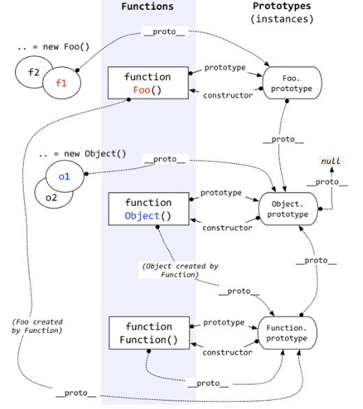

# js tips

## js引擎

参考网址： https://www.jianshu.com/p/81f6ded64ab2

+ JavaScript引擎是执行JavaScript代码的程序或解释器。javaScript引擎可以实现为标准解释器或即时编译器，它以某种形式将JavaScript编译为字节码。
+ v8引擎是一种js引擎的实现
+ V8是被设计用来提高网页浏览器内部JavaScript执行的性能

## 闭包

闭包就是能够读取其他函数内部变量的函数
由于内部匿名函数的作用域链 在引用 外部包含函数的活动对象 ，即使外部函数执行完毕了，它的活动对象还是不会被销毁！

即，外部函数的执行环境作用域链都销毁了，它的活动对象还在内存中留着呢。

并且根据垃圾回收机制，被另一个作用域引用的变量不会被回收。

所以，除非内部的匿名函数解除对活动变量的引用（解除对匿名函数的引用），才可以释放内存。

+ 常见问题， 如下代码

```js
<script type="text/javascript">
 function test(){
  var arr = [];
  for(var i = 0; i < 10; i++){
    arr[i] = function(){
      console.log(i);
    }
  }
  return arr;
 }
 var myArr = test();
 for(var j = 0;j<10;j++){
  myArr[j]();
 }
</script>
```

+ 使用立即执行函数解决闭包的问题

```js
<script type="text/javascript">
 function test(){
  var arr = [];
  for(var i = 0; i < 10; i++){
   (function(j){
    arr[j] = function(){
     console.log(j);
    }
   }(i));
  }
  return arr;
 }
 var myArr = test();
 for(var j = 0;j<10;j++){
  myArr[j]();
 }
</script>
```

## 内存泄漏

不再用到的内存，没有及时释放，就叫做内存泄漏（memory leak）

### 谷歌浏览器中查看内容泄漏

+ 打开开发者工具，选择 Performance 面板
+ 在顶部勾选 Memory
+ 点击左上角的 record 按钮
+ 在页面上进行各种操作，模拟用户的使用情况
+ 一段时间后，点击对话框的 stop 按钮，面板上就会显示这段时间的内存占用情况(如下图)
+ 查看js-heap走势图

> 有两种方式来判定当前是否有内存泄漏：

+ 多次快照后，比较每次快照中内存的占用情况，如果呈上升趋势，那么可以认为存在内存泄漏
+ 某次快照后，看当前内存占用的趋势图，如果走势不平稳，呈上升趋势，那么可以认为存在内存泄漏


### 造成内存泄漏的常见情况

+ 闭包
+ 未处理的setTimeout
+ dom引用
+ 全局变量

## slice（）与splice（）的用法和区别

+ 共性：都可以操作数据，截取一段数组
+ slice(start，end)

      从start开始截取到end但是不包括end
      返回值为截取出来的元素的集合
      原始的数组不会发生变化
+ splice(start,deleteCount,item1,item2…..);

      start参数 开始的位置
      deleteCount 要截取的个数
      后面的items为要添加的元素
      如果deleteCount为0，则表示不删除元素，从start位置开始添加后面的几个元素到原始的数组里面
      返回值为由被删除的元素组成的一个数组。如果只删除了一个元素，则返回只包含一个元素的数组。如果没有删除元素，则返回空数组
      这个方法会改变原始数组，数组的长度会发生变化

## 正则表达式

参考网址： https://www.w3cschool.cn/jsref/jsref-obj-regexp.html

+ [], 方括号用于查找某个范围内的字符

      表达式 描述
      [abc] 查找方括号之间的任何字符。
      [^abc] 查找任何不在方括号之间的字符。
      [0-9] 查找任何从 0 至 9 的数字。
      [a-z] 查找任何从小写 a 到小写 z 的字符。
      [A-Z] 查找任何从大写 A 到大写 Z 的字符。
      [A-z] 查找任何从大写 A 到小写 z 的字符。
      [adgk] 查找给定集合内的任何字符。
      [^adgk] 查找给定集合外的任何字符。
      (red|blue|green) 查找任何指定的选项

## html条件注释判断ie

  html5shiv：解决ie9以下浏览器对html5新增标签的不识别，并导致CSS不起作用的问题。

  respond.min:让不支持css3 Media Query的浏览器包括IE6-IE8等其他浏览器支持查询。

```javascript
  <!--[if !IE]><!--> 除IE外都可识别 <!--<![endif]-->
  <!--[if IE]> 所有的IE可识别 <![endif]-->
  <!--[if IE 6]> 仅IE6可识别 <![endif]-->
  <!--[if lt IE 6]> IE6以及IE6以下版本可识别 <![endif]-->
  <!--[if gte IE 6]> IE6以及IE6以上版本可识别 <![endif]-->
  <!--[if IE 7]> 仅IE7可识别 <![endif]-->
  <!--[if lt IE 7]> IE7以及IE7以下版本可识别 <![endif]-->
  <!--[if gte IE 7]> IE7以及IE7以上版本可识别 <![endif]-->
```

```javascript
  <!--[if lt IE 9]>

　 <script src="//cdn.bootcss.com/respond.js/1.4.2/respond.js"></script>

 　<script src="http://cdn.bootcss.com/html5shiv/3.7.2/html5shiv.min.js"></script>

  <![endif]—>
```

## 变量提升

+ 不管条件是否成立，判断体中出现的var/function都会进行变量提升
+ 在 JavaScript 中，函数声明（function aa(){}）与变量声明（var）经常被 JavaScript 引擎隐式地提升到当前作用域的顶部。函数声明的优先级高于变量，如果变量名跟函数名相同且未赋值，则函数声明会覆盖变量声明。声明语句中的赋值部分并不会被提升，只有变量的名称被提升
+ var存在变量提升，let和const不会

<font color="red">var在函数内部同一个变量可以重复声明，而在同一个块级作用域内部，let和const只能声明一次，并且const声明的是个常量，不能修改；var 声明的变量属于函数作用域，let 和 const 声明的变量属于块级作用域</font>

```js
var myname = "小明";
function showName(){ 
  console.log(myname); // undefined
  if(0){ var myname = "小红" }
  console.log(myname); // undefined 
}
showName();
```

## this指向

```js
<body>
  <button id="btn1">箭头函数this</button>
<script>
  let btn1 = document.getElementById('btn1');
  a = 1
  let obj = {
    name: 'kobe',
    age: 39,
    getName: function () {
      btn1.onclick = () => {
        // btn1.onclick = function (){ // 指向 btn1
        console.log(this);//obj
        console.log(this.age)
      };
    }
  };
  // obj.getName.call(window);
  obj.getName()
</script>
</body>
```
### 箭头函数

+ 箭头函数不会创建自己的this
+ 箭头函数继承而来的this指向永远不变
+ call、apply、bind无法改变箭头函数中this的指向
+ 不能作为构造函数使用
+ 没有自己的arguments
+ 没有原型prototype
+ 不能用作generator函数，不能使用yeild关键字

```js
function a() {
  return () => {
    return () => {
      console.log(this)
    }
  }
}
a()()()        //Window
```

首先箭头函数其实是没有 this 的，箭头函数中的 this 只取决包裹箭头函数的第一个普通函数的 this。在这个例子中，因为包裹箭头函数的第一个普通函数是 a，所以此时的 this 是 window。另外对箭头函数使用 bind这类函数是无效的。


## call、apply、bind

+ call、apply和bind是Function对象自带的三个方法，都是为了改变函数体内部 this 的指向。
+ apply 、 call 、bind 三者第一个参数都是 this 要指向的对象，也就是想指定的上下文；
+ apply 、 call 、bind 三者都可以利用后续参数传参；
+ bind 是返回对应 函数，便于稍后调用；apply 、call 则是立即调用 。

```js
function fruits() {}

fruits.prototype = {
 color: 'red',
 say: function() {
  console.log(this.color);
 }
};

var apple = new fruits();

apple.say();   // red, 此时方法里面的this 指的是fruits

banana = {color: 'yellow'};
apple.say.call(banana); //yellow,此时的this的指向已经通过call（）方法改变了，指向的是banana，this.color就是banana.color='yellow';

apple.say.apply(banana);//yellow,同理，此时的this的指向已经通过apply（）方法改变了，指向的是banana，this.color就是banana.color ='yellow';

apple.say.apply(null); //undefined, null是window下的，此时，this 就指向了window ，但是window下并没有clolr这个属性，因此this.clolr就是window.color=undefined;
```

```js
var bar = function(){
 console.log(this.x);
};
var foo = {
 x:3
};
bar();    // undefined
var func = bar.bind(foo); 

func(); // 3
```

## 宏任务/微任务

+ 宏任务：当前调用栈中执行的任务称为宏任务。（主代码快，定时器等等）。
+ .微任务： 当前（此次事件循环中）宏任务执行完，在下一个宏任务开始之前需要执行的任务为微任务。（可以理解为回调事件，promise.then，proness.nextTick等等）。
+ 宏任务中的事件放在callback queue中，由事件触发线程维护；微任务的事件放在微任务队列中，由js引擎线程维护。

微任务：process.nextTick、MutationObserver、Promise.then catch finally

宏任务：I/O、setTimeout、setInterval、setImmediate、requestAnimationFrame


### 运行机制

> 1. 在执行栈中执行一个宏任务。

> 2. 执行过程中遇到微任务，将微任务添加到微任务队列中。

> 3. 当前宏任务执行完毕，立即执行微任务队列中的任务。

> 4. 当前微任务队列中的任务执行完毕，检查渲染，GUI线程接管渲染。

> 5. 渲染完毕后，js线程接管，开启下一次事件循环，执行下一次宏任务（事件队列中取）。

## Event Loop

主线程运行的时候会生成堆（heap）和栈（stack）；
js 从上到下解析方法，将其中的同步任务按照执行顺序排列到执行栈中；
当程序调用外部的 API 时（比如 ajax、setTimeout 等），会将此类异步任务挂起，继续执行执行栈中的任务。等异步任务返回结果后，再按照顺序排列到事件队列中；
主线程先将执行栈中的同步任务清空，然后检查事件队列中是否有任务，如果有，就将第一个事件对应的回调推到执行栈中执行，若在执行过程中遇到异步任务，则继续将这个异步任务排列到事件队列中。
主线程每次将执行栈清空后，就去事件队列中检查是否有任务，如果有，就每次取出一个推到执行栈中执行，这个循环往复的过程被称为“Event Loop 事件循环”
浏览器页面渲染过程

浏览器渲染页面的一般过程：

+ 1.浏览器解析html源码，然后创建一个 DOM树。并行请求 css/image/js在DOM树中，每一个HTML标签都有一个对应的节点，并且每一个文本也都会有一个对应的文本节点。DOM树的根节点就是 documentElement，对应的是html标签。

+ 2.浏览器解析CSS代码，计算出最终的样式数据。构建CSSOM树。对CSS代码中非法的语法它会直接忽略掉。解析CSS的时候会按照如下顺序来定义优先级：浏览器默认设置 < 用户设置 < 外链样式 < 内联样式 < html中的style。

+ 3.DOM Tree + CSSOM --> 渲染树（rendering tree）。渲染树和DOM树有点像，但是是有区别的。

DOM树完全和html标签一一对应，但是渲染树会忽略掉不需要渲染的元素，比如head、display:none的元素等。而且一大段文本中的每一个行在渲染树中都是独立的一个节点。渲染树中的每一个节点都存储有对应的css属性。

+ 4.一旦渲染树创建好了，浏览器就可以根据渲染树直接把页面绘制到屏幕上。

以上四个步骤并不是一次性顺序完成的。如果DOM或者CSSOM被修改，以上过程会被重复执行。实际上，CSS和JavaScript往往会多次修改DOM或者CSSOM。

### 宏任务、微任务

参考网址： https://juejin.im/post/59e85eebf265da430d571f89

+ 宏任务： I/O、setTimeout、setInterval、requestAnimationFrame、script、
+ 微任务： process.nextTick、MultationObserver、Promise.then、Promise.catch、Promise.finally

遇到console.log、Promise、new Promis直接执行，输出对应内容， 遇到process.nextTick()、then、catch、finall将任务放到微任务队列

```js
console.log('1');

setTimeout(function() {
    console.log('2');
    process.nextTick(function() {
        console.log('3');
    })
    new Promise(function(resolve) {
        console.log('4');
        resolve();
    }).then(function() {
        console.log('5')
    })
})
process.nextTick(function() {
    console.log('6');
})
new Promise(function(resolve) {
    console.log('7');
    resolve();
}).then(function() {
    console.log('8')
})

setTimeout(function() {
    console.log('9');
    process.nextTick(function() {
        console.log('10');
    })
    new Promise(function(resolve) {
        console.log('11');
        resolve();
    }).then(function() {
        console.log('12')
    })
}

```

## requestAnimationFrame

  优势：
  由系统决定回调函数的执行时机。60Hz的刷新频率，那么每次刷新的间隔中会执行一次回调函数，不会引起丢帧，不会卡顿
  CPU节能：使用setTimeout实现的动画，当页面被隐藏或最小化时，setTimeout 仍然在后台执行动画任务，由于此时页面处于不可见或不可用状态，刷新动画是没有意义的，完全是浪费CPU资源。而requestAnimationFrame则完全不同，当页面处理未激活的状态下，该页面的屏幕刷新任务也会被系统暂停，因此跟着系统步伐走的requestAnimationFrame也会停止渲染，当页面被激活时，动画就从上次停留的地方继续执行，有效节省了CPU开销。
  函数节流：在高频率事件(resize,scroll等)中，为了防止在一个刷新间隔内发生多次函数执行，使用requestAnimationFrame可保证每个刷新间隔内，函数只被执行一次，这样既能保证流畅性，也能更好的节省函数执行的开销。

  ```js
  var start = null;
  var element = document.getElementById('SomeElementYouWantToAnimate');
  element.style.position = 'absolute';
  
  function step(timestamp) {
    if (!start) start = timestamp;
    var progress = timestamp - start;
    element.style.left = Math.min(progress / 10, 200) + 'px';
    if (progress < 2000) {
      window.requestAnimationFrame(step);
    }
  }
  
  window.requestAnimationFrame(step);
  ```

## Object.create()

+ Object.create()方法创建一个新对象，使用现有的对象来提供新创建的对象的__proto__

```js
  function Parent(name) {
    this.name = [name]
  }
  Parent.prototype.getName = function() {
    return this.name
  }
  function Child() {
    // 构造函数继承
    Parent.call(this, 'zhangsan')
  }
  //原型链继承
  // Child.prototype = new Parent()
  Child.prototype = Object.create(Parent.prototype)  //将`指向父类实例`改为`指向父类原型`
  Child.prototype.constructor = Child
  
  //测试
  const child = new Child()
  const parent = new Parent()
  child.getName()                  // ['zhangsan']
  parent.getName()  
```

## prototype



## js中数据存储

+ javascript的基本类型：Undefined，Null，Boolean，Number，String
+ 引用类型：Object，Array，Function

数据类型直接存储在栈（stack）中的简单数据段，占据空间小，大小固定，属于被频繁使用数据，所以放入栈中存储。引用数据类型存储在堆 (heap) 中的对象,占据空间大、大小不固定,如果存储在栈中，将会影响程序运行的性能；引用数据类型在栈中存储了指针，该指针指向堆中该实体的起始地址。当解释器寻找引用值时，会首先检索其在栈中的地址，取得地址后从堆中获得实体。即： 引用类型的地址存放在栈中，具体内容存放在堆中。

## 数据类型检测

+ typeof： typeof 返回一个表示数据类型的字符串，返回结果包括： number， boolean，string， symbol，object， undefined， function 7种数据类型 ，但是不能判断 null 和 array, 他们均返回 object
+ 判断数组，可以使用ES6方法： Array.isArray(obj)

```js
var f = function a() { return 'lllallala' }
typeof f // "function"
typeof f() // "string"
typeof a // undefined
typeof a() // VM937:1 Uncaught ReferenceError: a is not defined
f.name // "a", a 作为函数f的name属性而存在
```

```js
typeof Symbol(); // symbol
typeof ''; // string
typeof 1; // number
typeof true; //boolean
typeof undefined; //undefined
typeof new Function(); // function
typeof null; //object
typeof [] ; //object
typeof new Date(); //object
typeof new RegExp(); //object
```

+ Object.prototype.toString.call() 是检测类型最准确的常用方法

```js
Object.prototype.toString.call('') ; // [object String]
Object.prototype.toString.call(1) ; // [object Number]
Object.prototype.toString.call(true) ; // [object Boolean] Object.prototype.toString.call(undefined) ; // [object Undefined] Object.prototype.toString.call(null) ; // [object Null]
Object.prototype.toString.call(new Function()) ; // [object Function] Object.prototype.toString.call(new Date()) ; // [object Date]
Object.prototype.toString.call([]) ; // [object Array]
Object.prototype.toString.call(new RegExp()) ; // [object RegExp]
Object.prototype.toString.call( newError()) ; // [object Error]
Object.prototype.toString.call( document) ; // [object HTMLDocument]
Object.prototype.toString.call( window) ; //[object global] window是全局对象global的引用
```

## defer、async

+ defer： 如果script标签设置了该属性，则浏览器会异步的下载该文件并且不会影响到后续DOM的渲染；如果有多个设置了defer的script标签存在，则会按照顺序执行所有的script；defer脚本会在文档渲染完毕后，DOMContentLoaded事件调用前执行。
+ async： async的设置，会使得script脚本异步的加载并在允许的情况下执行。async的执行，并不会按着script在页面中的顺序来执行，而是谁先加载完谁执行

## load、DOMContentLoaded

```js
window.addEventListener('load',function(){...})//页面所有资源全部加载完才执行
document.addEventListener('DOMContentLoaded',function( ){...})//DOM渲染完即可执行，此时图片视频可能没加载完
```

## @param

+ 标签提供了对某个函数的参数的各项说明，包括参数名、参数数据类型、描述等。

```js
/**
 * @param {string} somebody - Somebody's name.
 */
 function sayHello(somebody) {
    alert('Hello ' + somebody);
}
```

```js
/**
 * Assign the project to an employee.
 * @param {Object} employee - The employee who is responsible for the project.
 * @param {string} employee.name - The name of the employee.
 * @param {string} employee.department - The employee's department.
 */
 Project.prototype.assign = function(employee) {    // ...};
```

## 缓存

+ 离线缓存允许我们在没网的时候通过读取离线文件进行站点的访问，而浏览器缓存即使浏览器又对资源文件的缓存也必须在有网的情况下读取缓存文件以提高文件加载速度，没网的时候依然显示网络断开的错误。

## trim

+ trim() 方法用于删除字符串的头尾空格

```js
let s = '  333 444 55  '
let t = s.trim(s)
console.log(t) // "333 444 55"
```

## 数组扁平化

参考网址： https://juejin.im/post/59716f15f265da6c4c500fc7

+ 使用for循环

```js
let result = [];
function flattern(arr) {
  for(let i =0;i<arr.length; i++) {
    if(Array.isArray(arr[i])) {
      flattern(arr[i])
    } else {
      result.push(arr[i])
    }
  }
  return result
}
```

+ 使用toString

```js
let t = ['1', '2', ['3', '5']]
t.toString().split(',')
```

+ 使用flat方法

```js
let t = ['1', '2', ['3', '5']]
t.flat(Infinity)
```

## replace() 方法的第二个参数 replacement 可以是函数而不是字符串

+ replace() 方法的第二个参数 replacement 可以是函数也可以是字符串
  
function（a,b,c,d）

该函数的第一个参数是匹配模式的字符串，第二个参数是与模式中的子表达式匹配的字符串，可以有 0 个或多个这样的参数第三个参数是一个整数，声明了匹配在 stringObject 中出现的位置，最后一个参数是 stringObject 本身

## 不同刷新的请求执行过程

参考网址： https://juejin.im/post/5a1d4e546fb9a0450f21af23

+ 浏览器地址栏中写入URL，回车浏览器发现缓存中有这个文件了，不用继续请求了，直接去缓存拿。（最快）
+ F5, F5就是告诉浏览器，别偷懒，好歹去服务器看看这个文件是否有过期了。于是浏览器就胆胆襟襟的发送一个请求带上If-Modify-since。
+ Ctrl+F5 告诉浏览器，你先把你缓存中的这个文件给我删了，然后再去服务器请求个完整的资源文件下来。于是客户端就完成了强行更新的操作.

## 跨域

参考网址： https://juejin.im/post/59c132415188256bb018e825

+ JSONP, jquery中的ajax可以实现跨域， dataType： jsonp

```js
  $.ajax({
    url: xxx,
    type: "GET",
    dataType: "jsonp",
    jsonp: "callback",
    crossDomain: true,
    cache: false,
    data: {
      xx: xx
    },
    success: function (res) {
      resolve(res)
    },
    error: function(err) {
      reject(err)
    }
  })
```

+ CORS
+ postMessage


## 十进制二进制

参考网址： https://blog.csdn.net/weixin_42061048/article/details/80140472

+ 正整数转二进制： 除二取余，倒序排列，高位补零。
+ 负整数转二进制： 先将对应的正整数转换成二进制后，对二进制取反，然后对结果再加1。
+ 小数转二进制： 对小数点以后的数×2，取结果的整数部分，然后再用小数部分再×2，再取结果的整数部分……以此类推，直到小数部分为0或者位数足够为止。然后把取的整数部分按先后次序排列，就构成了二进制小数部分的序列

*计算机内部表示数的字节单位是定长的，如8位，16位，或32位。所以，位数不够时，高位补零*

## 堆栈

+ 堆： 存储引用类型的空间
+ 栈： 存储基本类型值和执行代码的环境

## console.dir

console.log()会在浏览器控制台打印出信息

console.dir() / dir()可以显示一个对象的所有属性和方法


## session、cookie

  服务器设置session， 服务端返回给客户端的信息，在响应头中带着set-cookie='connect.sid' 客户端会把信息种植到本地的cookie中，httponly， 客户端再次向服务器发送请求的时候，会默认在请求头cookie把connect.sid传递给服务器

## decodeURI()与decodeURIComponent()

参考链接： https://blog.csdn.net/qq_39712029/article/details/81003518

decodeURI() => encodeURI()
decodeURIComponent() => encodeURIComponent()
区别：encodeURIComponent和decodeURIComponent可以编码和解码URI特殊字符（如#，/，￥等），而decodeURI则不能。

## cssText

平常使用js修改页面样式时，会这样：

```javascript
  obj.style.left = "100px";
```

但是当要修改的样式比较多时，这种方法就不太合适了，使用cssText可解决

```javascript
  $i.style.cssText =
   `z-index: 9999;
    top: ${y - 20}px; // 此处需要注意，后面跟px时，不需要使用引号，也不需要使用 + 连接
    left: ${x}px;
    position: absolute;
    font-weight: bold;
    font-size: ${c[c_idx]}px;
    color: ${b[b_idx]}`
```

## .native .stop

https://blog.csdn.net/weixin_41646716/article/details/90069562

## stringObject.localeCompare(target)

说明比较结果的数字。如果 stringObject 小于 target，则 localeCompare() 返回小于 0 的数。如果 stringObject 大于 target，则该方法返回大于 0 的数。如果两个字符串相等，或根据本地排序规则没有区别，该方法返回 0。

## sort

sort() 方法用于对数组的元素进行排序, 如果没有传参

+ 如果调用该方法时没有使用参数，将按字母顺序对数组中的元素进行排序
+ 如果想按照其他标准进行排序，就需要提供比较函数

```js
[3, -2, -1].sort() // -1 -2 3  *********
[3, -2, -1].sort((a, b) => { return a - b }) // -2 -1 3
[3, -2, -1].sort((a, b) => { return b - a }) // 3 -1 -2
```

## ~

利用符号进行的类型转换,转换成数字类型

```js
~~true == 1
~~false == 0
~~"" == 0
~~[] == 0

~~undefined ==0
~~!undefined == 1
~~null == 0
~~!null == 1
```

遇到一个使用类型： 取整

~~(12/10) // 1
~~(123/10) // 12
~~(129/10) // 12
