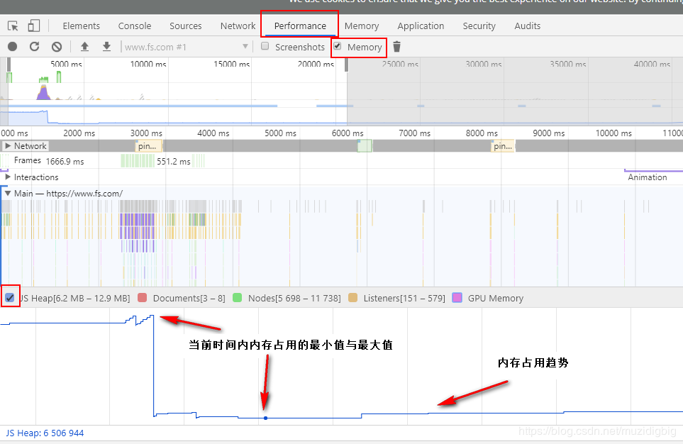

# js tips

## 闭包

闭包就是能够读取其他函数内部变量的函数
由于内部匿名函数的作用域链 在引用 外部包含函数的活动对象 ，即使外部函数执行完毕了，它的活动对象还是不会被销毁！

即，外部函数的执行环境作用域链都销毁了，它的活动对象还在内存中留着呢。

并且根据垃圾回收机制，被另一个作用域引用的变量不会被回收。

所以，除非内部的匿名函数解除对活动变量的引用（解除对匿名函数的引用），才可以释放内存。

+ 常见问题， 如下代码

```js
<script type="text/javascript">
 function test(){
  var arr = [];
  for(var i = 0; i < 10; i++){
    arr[i] = function(){
      console.log(i);
    }
  }
  return arr;
 }
 var myArr = test();
 for(var j = 0;j<10;j++){
  myArr[j]();
 }
</script>
```

+ 使用立即执行函数解决闭包的问题

```js
<script type="text/javascript">
 function test(){
  var arr = [];
  for(var i = 0; i < 10; i++){
   (function(j){
    arr[j] = function(){
     console.log(j);
    }
   }(i));
  }
  return arr;
 }
 var myArr = test();
 for(var j = 0;j<10;j++){
  myArr[j]();
 }
</script>
```

## 内存泄漏

### 谷歌浏览器中查看内容泄漏

+ 打开开发者工具，选择 Performance 面板
+ 在顶部勾选 Memory
+ 点击左上角的 record 按钮
+ 在页面上进行各种操作，模拟用户的使用情况
+ 一段时间后，点击对话框的 stop 按钮，面板上就会显示这段时间的内存占用情况(如下图)
+ 查看js-heap走势图

> 有两种方式来判定当前是否有内存泄漏：

+ 多次快照后，比较每次快照中内存的占用情况，如果呈上升趋势，那么可以认为存在内存泄漏
+ 某次快照后，看当前内存占用的趋势图，如果走势不平稳，呈上升趋势，那么可以认为存在内存泄漏



### 造成内存泄漏的常见情况

+ 闭包
+ 未处理的setTimeout
+ dom引用
+ 全局变量

## slice（）与splice（）的用法和区别

+ 共性：都可以操作数据，截取一段数组
+ slice(start，end)

      从start开始截取到end但是不包括end
      返回值为截取出来的元素的集合
      原始的数组不会发生变化
+ splice(start,deleteCount,item1,item2…..);

      start参数 开始的位置
      deleteCount 要截取的个数
      后面的items为要添加的元素
      如果deleteCount为0，则表示不删除元素，从start位置开始添加后面的几个元素到原始的数组里面
      返回值为由被删除的元素组成的一个数组。如果只删除了一个元素，则返回只包含一个元素的数组。如果没有删除元素，则返回空数组
      这个方法会改变原始数组，数组的长度会发生变化

## 正则表达式

参考网址： https://www.w3cschool.cn/jsref/jsref-obj-regexp.html

+ [], 方括号用于查找某个范围内的字符

      表达式 描述
      [abc] 查找方括号之间的任何字符。
      [^abc] 查找任何不在方括号之间的字符。
      [0-9] 查找任何从 0 至 9 的数字。
      [a-z] 查找任何从小写 a 到小写 z 的字符。
      [A-Z] 查找任何从大写 A 到大写 Z 的字符。
      [A-z] 查找任何从大写 A 到小写 z 的字符。
      [adgk] 查找给定集合内的任何字符。
      [^adgk] 查找给定集合外的任何字符。
      (red|blue|green) 查找任何指定的选项

## html条件注释判断ie

  html5shiv：解决ie9以下浏览器对html5新增标签的不识别，并导致CSS不起作用的问题。

  respond.min:让不支持css3 Media Query的浏览器包括IE6-IE8等其他浏览器支持查询。

```javascript
  <!--[if !IE]><!--> 除IE外都可识别 <!--<![endif]-->
  <!--[if IE]> 所有的IE可识别 <![endif]-->
  <!--[if IE 6]> 仅IE6可识别 <![endif]-->
  <!--[if lt IE 6]> IE6以及IE6以下版本可识别 <![endif]-->
  <!--[if gte IE 6]> IE6以及IE6以上版本可识别 <![endif]-->
  <!--[if IE 7]> 仅IE7可识别 <![endif]-->
  <!--[if lt IE 7]> IE7以及IE7以下版本可识别 <![endif]-->
  <!--[if gte IE 7]> IE7以及IE7以上版本可识别 <![endif]-->
```

```javascript
  <!--[if lt IE 9]>

　 <script src="//cdn.bootcss.com/respond.js/1.4.2/respond.js"></script>

 　<script src="http://cdn.bootcss.com/html5shiv/3.7.2/html5shiv.min.js"></script>

  <![endif]—>
```

## 变量提升

+ 不管条件是否成立，判断体中出现的var/function都会进行变量提升

```js
var myname = "小明";
function showName(){ 
  console.log(myname); // undefined
  if(0){ var myname = "小红" }
  console.log(myname); // undefined 
}
showName();
```

## this指向

```js
<body>
  <button id="btn1">箭头函数this</button>
<script>
  let btn1 = document.getElementById('btn1');
  a = 1
  let obj = {
    name: 'kobe',
    age: 39,
    getName: function () {
      btn1.onclick = () => {
        console.log(this);//obj
        console.log(this.a)
      };
    }
  };
  // obj.getName.call(window);
  obj.getName()
</script>
</body>
```