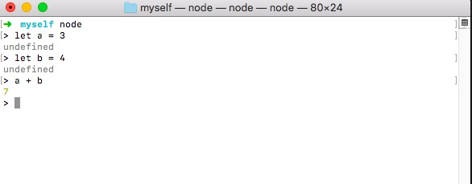
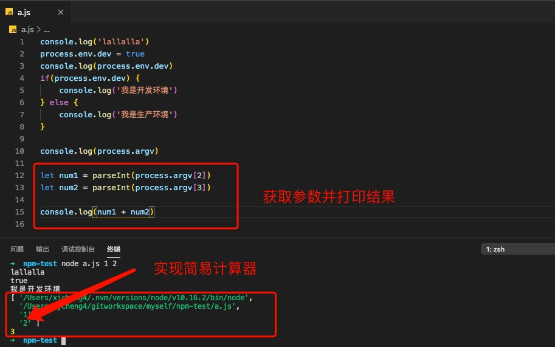

# 记录node小细节

## node功能与优势

+ 功能

1、写webAPI
2、作为中间层
3、前端工程化的一些（webpack， gulp）

+ 优势

1、 性能高
2、 便于前端入手

## 多个node版本

Node.js 的版本更新非常快，所有有时需要在多个版本之间切换，就需要安装多个版本的 Node.js.

### 工具

+ nvm（https://github.com/nvm-sh/nvm#install--update-script）， node版本管理工具

+ n（https://github.com/tj/n#installation）

### 常用命令

+ 查看版本号 nvm list 或者nvm ls
+ 下载node： nvm install 6.2.0， nvm install stable ## 安装最新稳定版 node
+ nvm uninstall <version>
+ 切换使用的node版本： node use 6.2.0

tips： nvm的安装方法详见 https://www.jianshu.com/p/622ad36ee020 和 https://www.jianshu.com/p/f6b290710262

## node运行本地文件

+ 安装完node之后，我们可以使用：node 文件名 的方式运行js文件， 也可以直接在命令行中运行js代码

```node
//创建文件夹
mkdir node-test
// 新建a.js文件
touch a.js
// 使用vscode打开文件夹
code node-test
// 运行a.js
node a // 这种方式，需要考虑文件夹下没有a文件，否则不会自动运行a.js文件，而是运行文件a
node a.js
```

进入node环境，只需在终端输入： node 按回车即可， 退出时按两次control + c


## node包管理工具

+ 由于npm的服务器在国外， 国内使用可能会比较慢，所以可以使用cnpm: 淘宝npm镜像

```node
npm install -g cnpm --registry=https://registry.npm.taobao.org
```

+ 常用命令

```node
// 初始化项目，生成package.json管理依赖
npm init

// 安装依赖

npm install xx
npm i xx

// 卸载依赖

npm uninstall xx
npm un xx

// 更新包

npm update xx
```

## node 模块

具体示例可以参考demo目录下 node-test 示例

### 全局模块

+ 定义： 何时何地都能访问， 不需要引用

+ process.env

+ process.argv

+ __dirname

实现简易的计算器



更多全局模块可到官网学习～

### 系统模块

+ 定义： 需要require(), 但不需要单独下载

+ path: 用于处理文件路径和目录路径的实用工具

+ fs: 用于文件读写操作

### 自定义模块

+ 定义： require 自己封装的模块

+ expors

+ module

+ require
  
  + 如果有路径，则从路径中找
  + 如果没有路径则从node_modules中找
  + 如果再没有，则从node的安装目录中去找

### http模块

+ http.createSever

## node 中的数据交互

### get

+ url?user=xxx&pass=xxx
+ < 32k
+ url 模块
+ url.parse(req.url, true)

### post

+ 参数放在body中
+ < 2G
+ querystring
+ querystring.parse(data)
