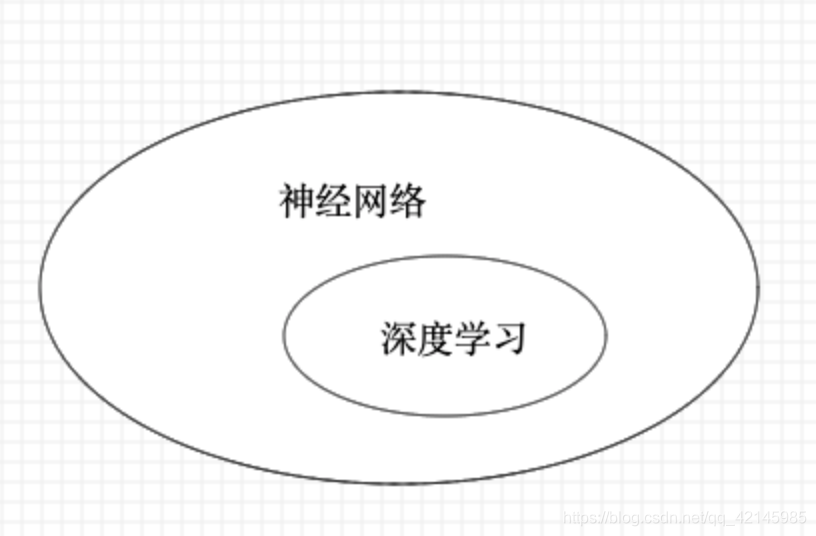

# 研究资料积累

## 专利相关

[参考1](https://zhuanlan.zhihu.com/p/65059271)
[参考2](https://zhuanlan.zhihu.com/p/56090433)

- 对比： 是用自己专利的权利要求请求保护的技术方案，与对方实施的技术方案对比，而不是拿自己的专利产品与其对比

- 被诉侵权技术方案包含与权利要求记载的全部技术特征相同或者等同的技术特征的，认定其落入专利权的保护范围

- 与权利要求记载的全部技术特征相比，缺少权利要求记载的一个以上的技术特征，或者有一个以上技术特征不相同也不等同的，认定其没有落入专利权的保护范围

- 如果被诉侵权的技术方案包含了权利要求未涉及的技术特征，即比权利要求技术特征多，该增加的技术特征在判断侵权时不需要考虑

- 等同特征：是指与权利要求所记载的技术特征以基本相同的手段，实现基本相同的功能，达到基本相同的效果，并且本领域普通技术人员在被诉侵权行为发生时无需经过创造性劳动就能够联想到的特征

- 一个权利解决一个问题

- 非必要技术可以不写，如果有多个点，可以分成多个专利来写
- 应该尽量采用概括性的术语或语句表达，以使其具有更广的含义，以将能够想到的更多实施可能性纳入权利要求保护范围中。

帧率、cpu占用率
1、通过对海量模型切片数据及贴图切片数据做真机测试，捕捉其加载过程中的CPU、内存、加载时间、渲染时间等多项性能指标
2、单一绘制调用，使用金字塔作为网格实例

文章： https://forum.orillusion.com/topic/39/chrome-writebuffer-performance
代码： https://codepen.io/ShuangLiu/embed/YzEEmLa?default-tab=html%2Cresult
3、方法测试WebGL.bufferSubData and WebGPU.writeBuffer

论文： 基于ＷｅｂＧＬ的ＶＲ留言签到系统
4、浏览器兼容性，手机端、web端

专利： 基于webGL的性能指标可视化方法及平台
5、帧率均值，CPU耗时， PSS内存， DrawCall次数， 三角面数量，并统计得到三角面数量最大值

文章： http://www.javashuo.com/article/p-gfhtdfug-ws.html
6、同一个场景的加载实现，添加模型、光源、动画等， 加载时间，帧率、内存消耗

7、基于DirectX显示引擎研究开发
线、面、圆、实体， 数量级的分类，10万、20万..., 使用的时间（绘制速度）、使用的内存
