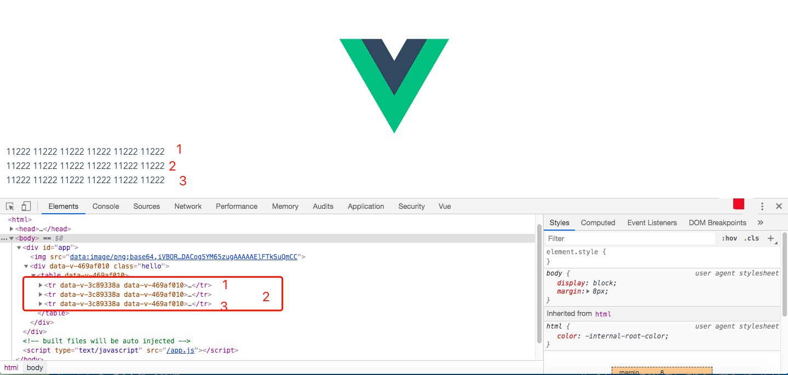
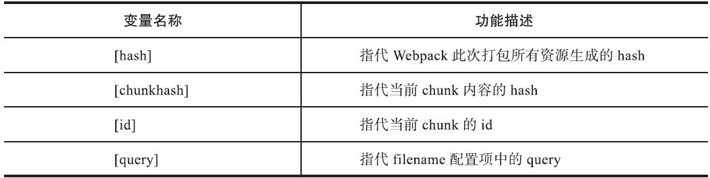
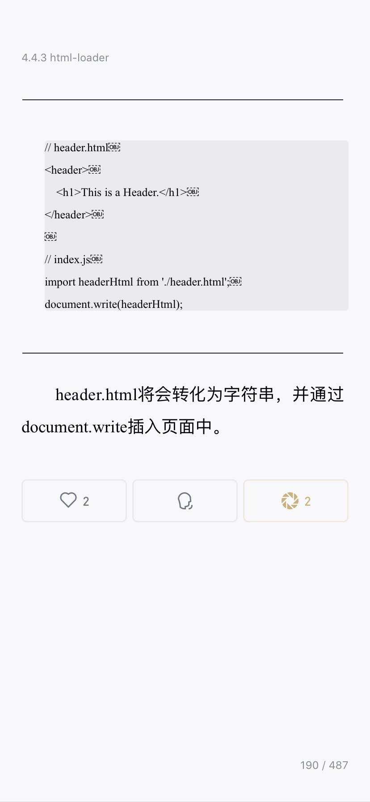

# vue项目中......

## 1. 处理ie9中调用el-select中显示光标的问题.............................

    document.querySelector('.el-input__inner').setAttribute('unselectable','on');

## 2.calc() 函数用于动态计算长度值。........

    需要注意的是，运算符前后都需要保留一个空格，例如：width: calc(100% - 10px)；

    任何长度值都可以使用calc()函数进行计算；.....

    calc()函数支持 "+", "-", "*", "/" 运算；
    calc()函数使用标准的数学运算优先级规则； 

## 3. 光标和文字样式分开修改

``` css
    textarea {
        color: black; // 文字和光标颜色均为黑色
        text-shadow: 0px 0px 0px rgba(255, 0, 0, 1); //文字阴影的方式显示文字内容，为红色，光标未选中textarea时的样式
        -webkit-text-fill-color: transparent; // 文字设置透明填充色
        background-color: rgba(0, 0, 0, 0); // 背景色为透明色
    }

    /*textarea:focus{
      text-shadow:0px 0px 0px rgba(255, 0, 0, 1);// 用于修改光标选中textarea时的文字颜色显示
    }*/
```

## 4./deep/  >>>  

    vue引用了第三方组件，需要在组件中局部修改第三方组件的样式，而有不想去除scoped属性造成组件之间的样式污染，此时可使用>>>，穿透scoped，有些sass之类的预处理器无法正确解析>>>, keyi shiyong /deep/操作符
    外层 >>> 第三方组件 {
       样式

    }

    /deep/ 第三方组件 {
       样式

    }

## 5.ie兼容性问题

  由于不同的浏览器，比如Internet Explorer 6, Internet Explorer 7, Mozilla Firefox等，对CSS的解析认识不一样，因此会导致生成的页面效果不一样，得不到我们所需要的页面效果。这个时候我们就需要针对不同的浏览器去写不同的CSS，让它能够同时兼容不同的浏览器，能在不同的浏览器中也能得到我们想要的页面效果。<u>这个针对不同的浏览器写不同的CSS code的过程，就叫CSS hack, 也叫写**CSS hack**</u>

### html条件注释判断ie

  html5shiv：解决ie9以下浏览器对html5新增标签的不识别，并导致CSS不起作用的问题。

  respond.min:让不支持css3 Media Query的浏览器包括IE6-IE8等其他浏览器支持查询。

```javascript
  <!--[if !IE]><!--> 除IE外都可识别 <!--<![endif]-->
  <!--[if IE]> 所有的IE可识别 <![endif]-->
  <!--[if IE 6]> 仅IE6可识别 <![endif]-->
  <!--[if lt IE 6]> IE6以及IE6以下版本可识别 <![endif]-->
  <!--[if gte IE 6]> IE6以及IE6以上版本可识别 <![endif]-->
  <!--[if IE 7]> 仅IE7可识别 <![endif]-->
  <!--[if lt IE 7]> IE7以及IE7以下版本可识别 <![endif]-->
  <!--[if gte IE 7]> IE7以及IE7以上版本可识别 <![endif]-->
```

```javascript
  <!--[if lt IE 9]>

　 <script src="//cdn.bootcss.com/respond.js/1.4.2/respond.js"></script>

 　<script src="http://cdn.bootcss.com/html5shiv/3.7.2/html5shiv.min.js"></script>

  <![endif]—>
```

### 常用的css hack

    “\9″ IE6/IE7/IE8/IE9/IE10都生效
    “\0″ IE8/IE9/IE10都生效，是IE8/9/10的hack
    “\9\0″ 只对IE9/IE10生效，是IE9/10的hack
  **eg:** *min-width: auto\0; *

### el-element 对ie的兼容性问题

    多是因为ie不兼容flex布局导致，有些可以使用display：inline-block解决

  _eg：el-radio-group在ie9中使用会导致文字不显示，可能是font-size：0导致_

  *tips: 常见将li标签设置为display:inline-block/inline后，两个li标签之间会有空白，使用font-size： 0设置ul的属性可以去除这些空白，但是会导致ul中的文字不显示，因此需要设置li标签的font-size为需要的文字大小*

## 6. 阿里巴巴矢量图

    图片加入到项目中后，在线修改图片颜色，可能会导致文件下载后页面中不显示对应的样式

  *eg: 下载了✅样式的图片，但是之前修改了图片的颜色，项目中可能只显示一个绿色的方框，里面的对号并不显示（记录）*

## 7. Window self 属性

    

    self 属性返回指向当前 window 对象的引用，利用这个属性，可以保证在多个窗口被打开的情况下，正确调用当前窗口内的函数或属性而不会发生混乱。
    self 属性是只读的。
  注：window、self、window.self 是等价的

## 8. 图灵机

    图灵机 (Turing machine, TM) 是由图灵在1936年提出的，它是一种精确的通用计算机模型，能模拟实际计算机的所有计算行为。

    所谓的图灵机就是指一个抽象的机器，它有一条无限长的纸带，纸带分成了一个一个的小方格，每个方格有不同的颜色。有一个机器头在纸带上移来移去。机器头有一组内部状态，还有一些固定的程序。在每个时刻，机器头都要从当前纸带上读入一个方格信息，然后结合自己的内部状态查找程序表，根据程序输出信息到纸带方格上，并转换自己的内部状态，然后进行移动。
    图灵机简单来说就是一个能接受信息、处理信息和发出信息的虚构的机器。世间万物皆为图灵机。

*词汇： 停机问题；P问题； NP问题； NPC问题*

## 9.-webkit-line-clamp （限制在一个块元素显示的文本的行数）

    限制在一个块元素显示的文本的行数。

    -webkit-line-clamp 是一个不规范的属性（unsupported WebKit property），它没有出现在 CSS 规范草案中。

    为了实现该效果，它需要组合其他外来的WebKit属性。常见结合属性：

    display: -webkit-box; 必须结合的属性 ，将对象作为弹性伸缩盒子模型显示
    -webkit-box-orient 必须结合的属性 ，设置或检索伸缩盒对象的子元素的排列方式

    text-overflow，可以用来多行文本的情况下，用省略号“...”隐藏超出范围的文本

  *eg:*
  

``` 
    *overflow : hidden; //超出部分隐藏*   
    *text-overflow: ellipsis;  //内容超出显示为省略号*    
    *display: -webkit-box;  //必要的属性*   
    *-webkit-line-clamp: 2;  //显示为两行内容*    
    *-webkit-box-orient: vertical;  //设置或检索伸缩盒对象的子元素的排列方式*     
  ```

    如果你标签内的是英文，英文是不会自动换行的，所以你需要让他自动换行添加如下代码即可:
    word-wrap:break-word;
    word-break:break-all;

## 10. 数组内容发生改变，view未重新渲染？

  this.$set(target, key, value)

    target：要更改的数据源(可以是对象或者数组)
    key：要更改的具体数据(可以是字符串和数字)

    value ：重新赋的值

    另外，vue重写了数组的push、pop等方法，使这些操作下的变动可以被监听到。

  使用中间变量逐个接收数组内容，然后在逐个赋值给原来的数组，可以实现view重新渲染的效果，但是需要用到多行代码
  

``` 
    origin: 原数组
    temp: 中间数组
    let temp = []
    origin.forEach(item => {
      temp.push(item)
    })
    origin = []
    temp.forEach(item => {
      origin.push(item)
    })
  ```

## 11.vue中event的使用

 + ### Element UI 的el-input同时绑定@keyup.enter.native和@blur冲突
  > 解决方法：使用keyup事件触发blur事件: $event.target.blur
  

``` 
    <div class="keyword-content">
        <el-input
            class="input-new-tag"
            v-if="inputVisible"
            v-model="inputValue"
            ref="saveTagInput"
            size="small"
            @keyup.enter.native="$event.target.blur"
            @blur="handleInputConfirm">
        </el-input>
    </div>
  ```

 + ### vue函数中使用event
  > 使用不带圆括号的形式，event 对象将被自动当做实参传入；
  > 使用带圆括号的形式，我们需要使用 $event 变量显式传入 event 对象。

使用不带圆括号的形式：
  

``` 
  <div id="app">
    <button v-on:click="click">click me</button>
  </div>

  var app = new Vue({
    el: '#app',
    methods: {
        click(event) {
            console.log(typeof event);    // object
        }
    }
  });
  ```

  使用带圆括号的形式：
  
```html
  <div id="app">
    <button v-on:click="click($event, 233)">click me</button>
  </div>
  var app = new Vue({
    el: '#app',
    methods: {
        click(event, val) {
            console.log(typeof event);    // object
        }
    }
  });
```

## 12. 环境变量配置

> $HOME是一个环境变量，它代表当前登录的用户的主文件夹
> $HOME/bin当然就是主文件夹下的bin子目录
> PATH=$PATH:$HOME/bin这句是设置PATH环境变量（设置环境变量用等号），首先: 冒号是分割符（记得Windows上面也有PATH环境变量，Windows的路径之间的分隔符是; 分号），$PATH:$HOME/bin表示在保留原来的$PATH环境变量的基础上，再增加$HOME/bin这个路径作为新的$PATH环境变量。

## 13. Deepen memory , some tips

+ CSS background-blend-mode 属性

```css
  定义了背景层的混合模式（图片与颜色)
  background-blend-mode: normal|multiply|screen|overlay|darken|lighten|color-dodge|saturation|color|luminosity;
```

+ vue中native修饰符的使用

```javascript
  在某个组件的根元素上监听一个原生事件。可以使用 v-on 的修饰符 .native
  就是在父组件中给子组件绑定一个原生的事件，就将子组件变成了普通的HTML标签，不加'.native'事件是无法触发的
```

+ vue 中is的使用

  实现组件的异步加载

```javascript
  <template>
    <div class="hello">
      <table>
        <tr is="honor"></tr>
        <honor></honor>
        <tr :is="currcomp.component"></tr>
      </table>
    </div>
  </template>
  <script>
  import honor from '@/components/honor'
  export default {
    name: 'HelloWorld',
    data () {
      return {
        currcomp: {
          name: 'honors',
          component: resolve => require(['@/components/honor'], resolve)
        }
      }
    },
    methods: {
    },
    components: {
      honor
    }
  }
  </script>
```

  _honor组件内容_

```
    <template>
      <tr>
          <td>11222</td>
          <td>11222</td>
          <td>11222</td>
          <td>11222</td>
          <td>11222</td>
          <td>11222</td>
      </tr>
    </template>
  ```

  在table标签中引入组件的三种方法，代码对应页面显示如下，或者将honor中标签tr修改为其他标签名称，比如div或者aaaa，页面显示如下图所示
  *<font color=#aaa size=0.5 face="黑体">如果使用了未定义的标签aaaa，页面会显示对应内容，但是会报错，did you register the component correctly</font>*
  

  + es6中pad的使用
    padStart()用于头部补全，padEnd()用于尾部补全， 接收两个参数，第一个参数为字符串的最小长度，第二个参数为补全的字符串。
    比如月份前面补全0，1月可补全为01，保持月份始终是两位

```javascript
let s = "1"
let t = s.padStart(2, '0)
console.log(t) // 01
console.log(s) // 1
```

  + Content-disposition

  是 MIME 协议的扩展，MIME 协议指示 MIME 用户代理如何显示附加的文件。Content-disposition其实可以控制用户请求所得的内容存为一个文件的时候提供一个默认的文件名，文件直接在浏览器上显示或者在访问时弹出文件下载对话框。

  + webpack 相关


  >如何利用webpack来优化前端性能？（提高性能和体验）
  >> 用webpack优化前端性能是指优化webpack的输出结果，让打包的最终结果在浏览器运行快速高效。压缩代码。删除多余的代码、注释、简化代码的写法等等方式。可以利用webpack的UglifyJsPlugin和ParallelUglifyPlugin来压缩JS文件， 利用cssnano（css-loader?minimize）来压缩css。利用CDN加速。在构建过程中，将引用的静态资源路径修改为CDN上对应的路径。可以利用webpack对于output参数和各loader的publicPath参数来修改资源路径；删除死代码（Tree Shaking）。将代码中永远不会走到的片段删除掉。可以通过在启动webpack时追加参数--optimize-minimize来实现提取公共代码。

> 使用vendor配置
>> 其依赖的第三方模块将会被抽取出来生成一个新的bundle，这也就达到了我们提取vendor的目标。由于vendor仅仅包含第三方模块，这部分不会经常变动，因此可以有效地利用客户端缓存，在用户后续请求页面时会加快整体的渲染速度。可以采用optimization.splitChunks。将app与vendor这两个chunk中的公共模块提取出来。当第三方依赖较多时，我们可以用提取vendor的方法将这些模块打包到一个单独的bundle中，以更有效地利用客户端缓存，加快页面渲染速度。

> webpack output配置。
>>[hash]和[chunkhash]都与chunk内容直接相关，在filename中使用了这些变量后，当chunk的内容改变时，可以同时引起资源文件名的更改，从而使用户在下一次请求资源文件时会立即下载新的版本而不会使用本地缓存。[query]也可以起到类似的效果，只不过它与chunk内容无关，要由开发者手动指定。在实际工程中，我们使用比较多的是[name]，它与chunk是一一对应的关系，并且可读性较高。如果要控制客户端缓存，最好还要加上[chunkhash]，因为每个chunk所产生的[chunkhash]只与自身内容有关，单个chunk内容的改变不会影响其他资源，可以最精确地让客户端缓存得到更新。



> SourceMap 一个存储源代码与编译代码对应位置映射的信息文件
>>在前端的工作中主要是用来解决以下三个方面出现的 debug 问题  a. 代码压缩混淆后  
b. 利用 sass 、typeScript 等其他语言编译成 css 或 JS 后  
c. 利用 webpack 等打包工具进行多文件合并后  

> 在计算机科学中，抽象语法树（Abstract Syntax Tree，AST），或简称语法树（Syntax tree），是源代码语法结构的一种抽象表示。

> 什么是Tree-shaking
>>Tree-shaking原始的本意
通过工具"摇"我们的JS文件，将其中用不到的代码"摇"掉，是一个性能优化的范畴
具体来说，在 webpack 项目中，有一个入口文件，相当于一棵树的主干，入口文件有很多依赖的模块，相当于树枝。实际情况中，虽然依赖了某个模块，但其实只使用其中的某些功能。通过 tree-shaking，将没有使用的模块摇掉，这样来达到删除无用代码的目的

> Handlebars 是 JavaScript 一个语义模板库，通过对view和data的分离来快速构建Web模板。



## 13. 单点登录

+ 单点登录（Single Sign On），简称为 SSO，是目前比较流行的企业业务整合的解决方案之一。SSO的定义是在多个应用系统中，用户只需要登录一次就可以访问所有相互信任的应用系统。

+ 一般来说，Web应用需要SSO的功能，应该通过以下的交互过程来调用身份认证服务的提供的认证服务：Web应用中每一个需要安全保护的URL在访问以前，都需要进行安全检查，如果发现没有登录（没有发现认证之后所带的cookie），就重新定向到SSOAuth中的login.jsp进行登录。
登录成功后，系统会自动给你的浏览器设置cookie，证明你已经登录过了。
当你再访问这个应用的需要保护的URL的时候，系统还是要进行安全检查的，但是这次系统能够发现相应的cookie。
有了这个cookie，还不能证明你就一定有权限访问。因为有可能你已经logout,或者cookie已经过期了，或者身份认证服务重起过，这些情况下，你的cookie都可能无效。应用系统拿到这个cookie，还需要调用身份认证的服务，来判断cookie时候真的有效，以及当前的cookie对应的用户是谁。
如果cookie效验成功，就允许用户访问当前请求的资源
这里我们需要注意的是：你每次关闭一个浏览器，cookie就失效了。

+ 如何拿到cookie

```js
function getCookie(cookieName) {
    var strCookie = document.cookie;
    var arrCookie = strCookie.split("; ");
    for(var i = 0; i < arrCookie.length; i++){
        var arr = arrCookie[i].split("=");
        if(cookieName == arr[0]){
            return arr[1];
        }
    }
    return "";
}
var user_id = getCookie("uid");//拿到名字为uid的cookie值
c_start=document.cookie.indexOf("uid=");//取得这个cookie名在整个cookie中的位置
//判断cookie是否有uid
if(c_start == -1){
     //没有uid的时候
}
```

## svg

为什么要使用svg？

+ svg为矢量图， 伸缩自如，不影响图片的清晰度

+ 图片更小，响应更快。矢量图是使用相对点来保存数据的，而位图则是无数个像素点组成，越大越清晰的位图所占用的数据大小就会越大，而svg的图片则不会有这种结果

+ 更高的可编辑性。svg图片是基于XML语言编辑而成的，天生拥有更贴合HTML的属性，可以自由的在HTML、CSS中引用。 而且可以通过css、JavaScript来为svg图片设置动画效果。

+ 超强显示效果。SVG图像在屏幕上总是边缘清晰，它的清晰度适合任何屏幕分辨力和打印分辨力。

+ 超级颜色控制。SVG图像提供一个1 600万种颜色的调色板，支持ICC颜色描述文件标准、RGB、线X填充、渐变和蒙版。

+ 交互X和智能化。SVG面临的主要问题一个是如何和已经占有重要市场份额的矢量图形格式Flash竞争的问题，另一个问题就是SVG的本地运行环境下的厂家支持程度。

以上特点均可提供更好的用户体验。 但是它存在一定的兼容性问题。