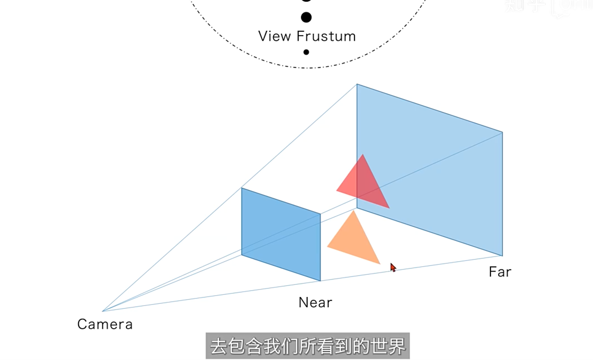

# webGPU 
## 示例代码

- [代码地址](https://github.com/Orillusion/orillusion-webgpu-samples.git)
- [视频讲解](https://www.zhihu.com/org/orillusionguan-fang/zvideos)

```others
不能将一般的array、object直接传递给GPU, 需要转换成typedArray的形式， new FLoat32Array→生成的数据是给cpu使用的，GPU没法直接使用，需要使用device.creatBuffer为GPU创建变量， new FLoat32Array（[1.0, 0.0, 1.0, 1.0]）, 一个数字对应4个字节
GPUBufferUsage.COPY_DST // 表示当前buffer可以作为拷贝的目标，如果不加这个参数，对应变量是不能被写入数据的，变量a加了这个参数，可以被拷贝

GPUBufferUsage.UNIFORM // 只读，不可更改，最大值64kb

GPUBufferUsage.STORAGE // 最大值2GB，可更改

arrayStride 表示要将buffer以多大的数据量进行切分

color为0-1的小数

通过creatBindGroup将buffer进行组合，对应的参数为entries，为一个array类型，可以绑定多个资源
```
## 基础知识

- 坐标系： webGPU坐标， 屏幕中心点为（0， 0， 0）， 对应xyz， 屏幕往里，为z轴，z轴的范围为0-1，x轴为从左往右，-1到1， y轴从下往上为-1到1


- 任何的变化都可以通过平移、旋转、缩放来实现，通过矩阵可以实现响应的变化，定点坐标矩阵信息→通过平移、旋转、缩放矩阵，将一个图形进行坐标变换，近大远小。如下图所示：




## Messy text

[参考地址](https://www.orillusion.com/zh/explainer.html#gpu-process)

[锚](https://www.orillusion.com/zh/explainer.html#use-cases)
- 使用新的渲染技术（基于计算的粒子、更高级的后处理等）并将当前在 CPU 上完成的昂贵计算（剔除、蒙皮模型）卸载到 GPU。
- 将更新的游戏引擎移植到 Web，并使引擎能够公开更高级的渲染功能，更高级的渲染功能, WebGPU 可以使用更高的功能集
- 将新类别的应用程序移植到 Web：许多生产力应用程序将计算卸载到 GPU，并且需要 WebGPU 对一般计算的支持


- WebGPU 允许访问 GPU 的更高级功能， 对在 GPU 上执行一般计算具有一流的支持，执行计算并绘制可以在页面内呈现的复杂图像 
- 在原生 GPU API 中，当缓冲区被映射时，CPU 可以访问其内容,导致 CPU 和 GPU 之间的数据竞争; GPUBuffer 映射是作为 CPU 和 GPU 之间的所有权转移来完成的,在每一瞬间，只有两者中的一个可以访问它，因此不可能进行竞争,目前，可映射缓冲区只能用于传输数据(3.5.1[锚](https://www.orillusion.com/zh/explainer.html#buffer-mapping-ownership))
- WebGPU 没有“默认”绘图缓冲区, WebGPU 设备可以连接到任意数量的画布（零个或多个）并在每一帧渲染到任意数量的画布


### webGPU相比webGL的优势

1. webGPU提供了对GPU更大范围的控制，从而能提高性能

2. webGPU更好的支持多线程

3. webGPU支持计算管线，从而让程序员能使用GPU进行计算

4. webGPU与webGL2区别很大，升级的话可以直接升级为webGPU

5. 各大浏览器都会支持webGPU，而ios不支持webGL2
### future
- 将来，可能会提供一个事件，允许应用程序检测画布何时移动到具有不同属性的<font color=#ff0000>显示器</font>，以便它们可以再次调用 getSwapChainPreferredFormat() 和 configureSwapChain()； 由于帧缓冲区硬件的差异，不同的设备对显示表面有不同的首选字节布局

- 目前，WebGPU 不提供检测哪个<font color=#ff0000>适配器</font>最适合给定显示器的方法。 将来，应用程序可能能够检测到这一点，并在发生变化时接收事件

- 安全方面： 
   1. 对安全问题的处理-恶意应用程序可能会感知到其中一些单元受到压力，并通过分析应力模式来试图猜测另一个应用的工作量[锚](https://www.orillusion.com/zh/webgpu.html#security-computation-resources)

- qe： 规范是否允许与跨源数据交互？ ans： 目前 WebGPU 无法做到这一点，但将来很可能有人会要求这些功能。[锚](https://www.orillusion.com/zh/explainer.html#questionnaire-18)
### tips

- 在计算机图形学中，swapchain(交换链)是一系列虚拟帧缓冲区，由显卡和图形API用于稳定帧速率和其他一些功能。swapchain通常存在于图形内存中，但也可以存在于系统内存中。不使用swapchain可能会导致渲染卡顿，它的存在和使用是许多图形api所必需的，具有两个缓冲区的swapchain是双缓冲区。
- HDR（High Dynamic Range），即高动态范围图像。与普通的图像处理相比，HDR可以提供更多的动态表现和图像细节，根据不同的曝光时间相对应的最佳细节来合成最终图像，能够更好地反映出真实环境中物体所自有的视觉效果，因此更加接近人眼可见的真实画面，做到画面亮部不过曝，暗部细节清晰可见
- Sandbox(又叫沙箱、沙盘)即是一个虚拟系统程序，允许你在沙盘环境中运行浏览器或其他程序，因此运行所产生的变化可以随后删除。它创造了一个类似沙盒的独立作业环境，在其内部运行的程序并不能对硬盘产生永久性的影响。不能在你的硬盘上写入任何数据，也不能在敏感位置读取任何数据。 在网络安全中，沙箱指在隔离环境中，用以测试不受信任的文件或应用程序等行为的工具。[锚](https://baike.baidu.com/item/%E6%B2%99%E7%AE%B1/393318?fr=aladdin)

- Dawn 是基于c++的一个开源项目，它是负责chrome的底层的webGPU的适配工作-底层模块，WebGPU 是一个正在开发中的新一代 Web 图形标准，而 Dawn 是一个它的开源跨平台实现。webgpu.h 定义了 C 接口到 WebGPU IDL 的一对一映射，Dawn 提供了实现。Dawn 也作为 Chromium 项目中 WebGPU 的底层实现。


- chrome 查看渲染性能指标： 打开控制台-> ... -> 更多工具 -> 渲染 -> 选中帧渲染统计数据
- chrome 浏览器 -> 窗口 -> 任务管理器 -> 查看各个页面cpu占用、内存的使用情况
- mac 笔记本-> 应用程序 -> 其他 -> 活动监视器，可以用来查看各个进程的id、 cpu、GPU等的使用情况

### 对比指标

技术比较：
1. webGPU webGL

比较场景： 

1. 大量数据渲染，复杂场景实现
2.  大数据量的写入场景下 （Chrome 目前 WebGPU 相关 API 还没有优化完成，尤其是 writeBuffer 和 mapAsync 的性能没有完全发挥，是目前 WebGPU 主要的性能瓶颈， 大数据量的写入场景下, 拖垮 FPS 的是 writeBuffer 的速度）
3. 不同的机型环境下，比如mac <-> window, 普通集显环境 <-> rtx独立显卡

性能指标：

1. 不同情况下的frame rate对比, 页面渲染一帧所需要的时间， 
2. cpu耗时： 添加大量计算任务，比较计算耗时，主要比较cpu耗时， compute shader
<!-- 3. drawcall次数 -->
4. 内存使用
5. 首屏渲染时间
6. 最大数据量是多少， 比如相同场景下，不同技术最大能够创建多少盒子
 


一些函数的使用比较 [锚](https://forum.orillusion.com/topic/39/chrome-writebuffer-performance)


参考项目地址： 
- https://toji.github.io/webgpu-clustered-shading/
- https://toji.github.io/webgpu-test/
- https://toji.github.io/webgpu-shadow-playground/
- https://austin-eng.com/webgpu-samples/samples/helloTriangle
- https://toji.github.io/webgpu-clustered-shading/
- https://toji.github.io/webgpu-shadow-playground/
- https://toji.github.io/webgpu-metaballs/
- https://contrast.orillusion.com/


## setPipeline、setVertexBuffer、setBindGroup

尽量复用，减少对性能的影响。原则上绘制过程中应该尽量减少切换GPU的状态

setPipeline > setVertexBuffer > setBindGroup

setPipeline： 切换管线影响最大，会切换整个vertexShader、fragmentShader、深度测试、图形组装、颜色混合等相关配置
setVertexBuffer： 会根据管线配置去识别和转换顶点数据，shader内部还要对应的生成一些局部变量，频繁切换影响渲染效率
setBindGroup： 作为外部或全局变量的引入，对管线本身的配置没有影响，大多数情况下只是内存指针的拷贝或重新定向而已，是一种效率很高的操作

