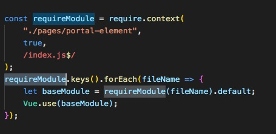

# webpack 相关内容

## 使用require.context实现前端工程自动化

+ require.context 的应用场景

      一个webpack的api,通过执行require.context函数获取一个特定的上下文,主要用来实现自动化导入模块,在前端工程中,如果遇到从一个文件夹引入很多模块的情况,可以使用这个api,它会遍历文件夹中的指定文件,然后自动导入,使得不需要每次显式的调用import导入模块

+ 参数

require.context函数接受三个参数

directory {String} -读取文件的路径

useSubdirectories {Boolean} -是否遍历文件的子目录

regExp {RegExp} -匹配文件的正则

      require.context('./test', false, /.test.js$/)

例如上图引入后，即可在其他页面直接使用。

+ 返回结果

require.context函数执行后返回的是一个函数,并且这个函数有3个属性

resolve {Function} -接受一个参数request,request为test文件夹下面匹配文件的相对路径,返回这个匹配文件相对于整个工程的相对路径

keys {Function} -返回匹配成功模块的名字组成的数组

id {String} -执行环境的id,返回的是一个字符串,主要用在module.hot.accept,应该是热加载
